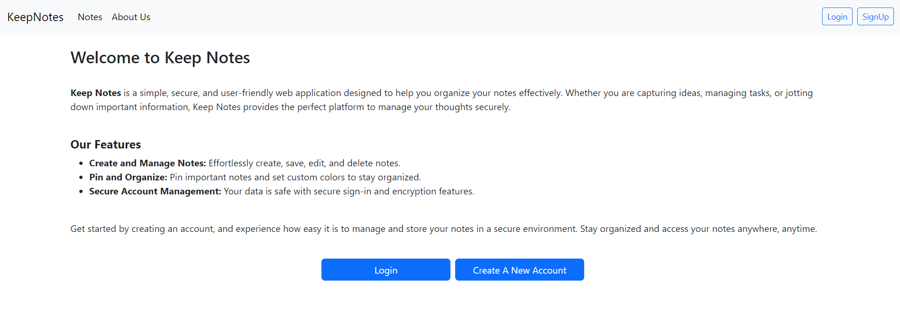
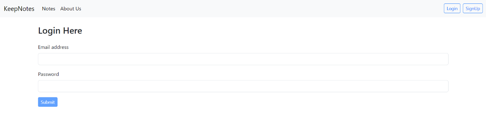
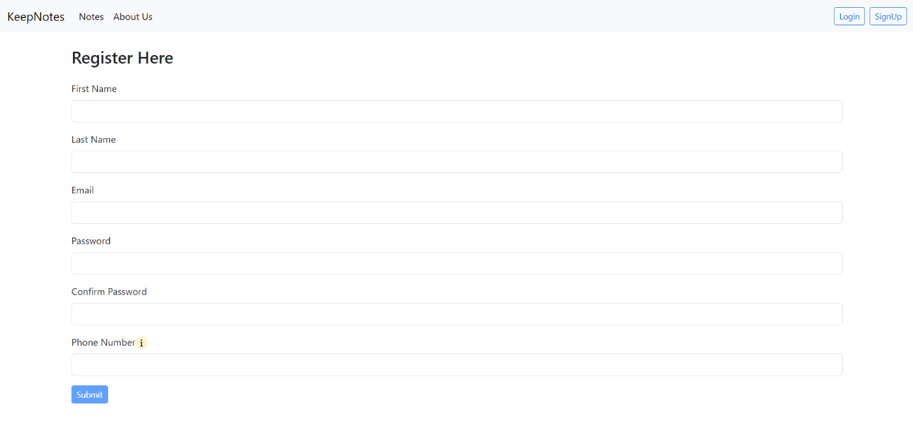
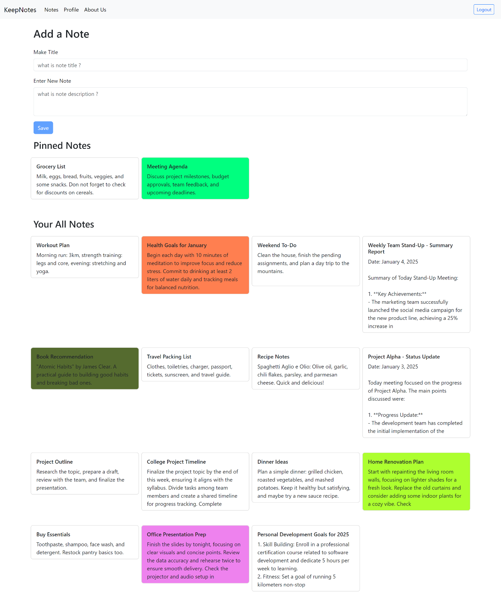
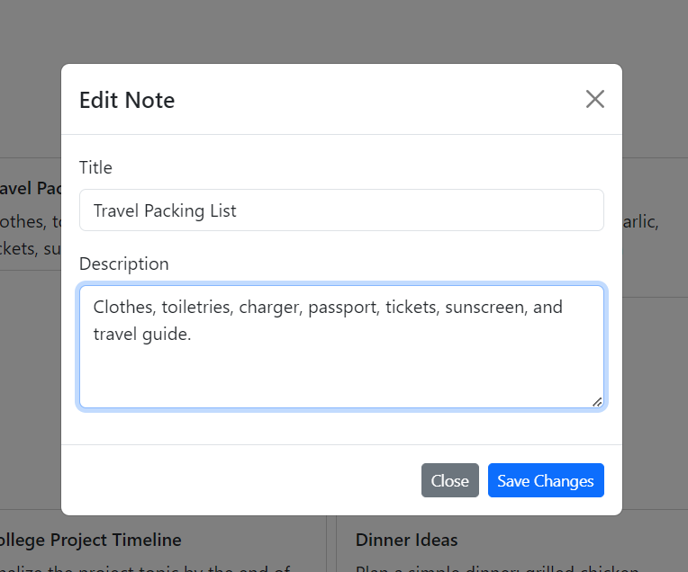
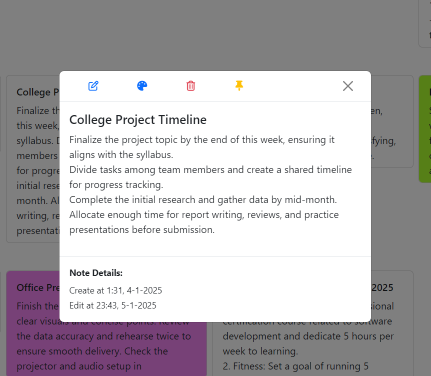
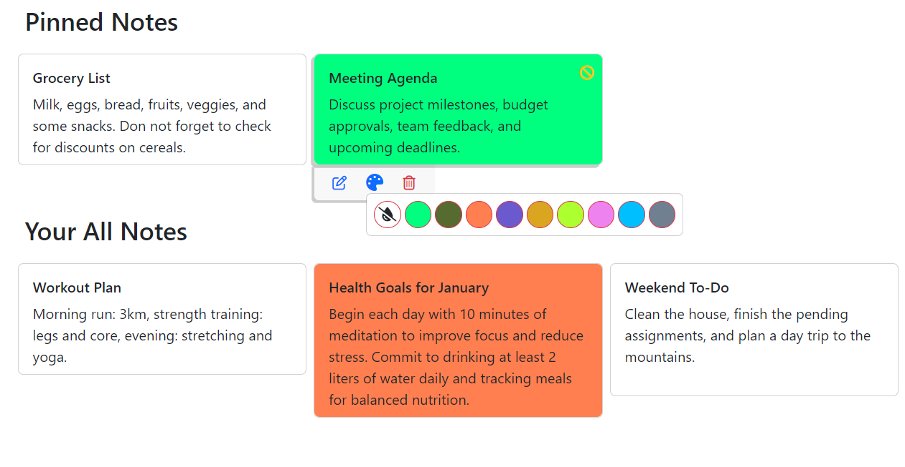
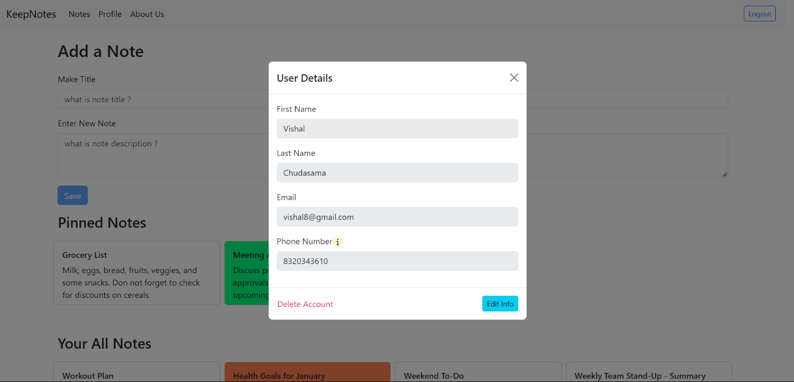

# 📝 KeepNotes - Spring Boot Note-Taking Application

**KeepNotes** is a full-stack **note-taking web application** built using **Spring Boot, JSP, Hibernate (JPA), and MySQL**.
It allows users to securely create, manage, and organize their personal notes with full CRUD functionality.

---

## 🚀 Features

### 🔐 Authentication

* User Registration
* Secure Login System

### 🗒️ Note Management

* Create Notes
* View Notes
* Edit Notes
* Delete Notes
* Pin & Unpin Notes
* Set Color on Notes

### ⚙️ Backend Features

* Built with **Spring Boot (MVC Architecture)**
* Uses **Hibernate (JPA)** for ORM
* MySQL database integration
* Layered architecture (Controller → Service → Repository)

### 🎨 Frontend

* JSP for dynamic views
* JQuery, JavaScript, HTML, CSS for UI

---

## 🧰 Tech Stack

### Backend

* Java 21
* Spring Boot
* Spring MVC
* Hibernate (JPA)

### Frontend

* JSP
* JQuery
* JavaScript
* HTML, CSS

### Database

* MySQL

---

## 📂 Project Structure

```id="3kl9a1"
KeepNotes_SpringBoot/
│
├── src/main/java/in/v8/main/
│   ├── controllers/
│   ├── services/
│   ├── repositories/
│   └── entities/
│
├── src/main/
│   ├── webapp/WEB-INF/views/       -- all view pages
│   └── resources/
|       └── application.properties  -- database configuration
│
└── pom.xml
```

---

## ⚙️ How to Run

### 1️⃣ Clone Project

```bash id="u0r8y9"
git clone https://github.com/VishalChudasama08/KeepNotes_SpringBoot.git
```


### 2️⃣ Configure Database

Update in `application.properties`:

```properties id="x8z0s2"
spring.datasource.url=jdbc:mysql://localhost:3306/keepnotes_db
spring.datasource.username=root
spring.datasource.password=
```


### 3️⃣ Run Project

* Open in **Spring Tool Suite / IntelliJ**
* Run as **Spring Boot App**

---

### 4️⃣ Access

```id="z7l3k1"
http://localhost:8080/
```


## 📸 Screenshots

### 🏠 Home Page



### 🔐 Login & Register Page




### 📝 Notes Dashboard



### ✏️ Edit Note



## 📌 Pinned & 🚫 Unpinned Note, 🎨 Set Color, 🧹 Delete Note




## 👤 Profile




---

## 🔄 Project Comparison

This project is a **Java-based implementation** of the same concept as my MERN stack project:

👉 MyNotes (React + Node.js + MongoDB)

It demonstrates how the same application can be built using **different technologies and architectures**.


## 💡 Future Enhancements

* Search functionality
* Rich text editor
* Tagging system
* REST API version

---

## 👨‍💻 Author

**Vishal Chudasama**

* MCA Student
* Passionate about Full-Stack Development

## 📬 Contact Me

* Email:     ```  chudasamavishal183@gmail.com  ```
* LinkdIn:   ```  https://www.linkedin.com/in/vishal-chudasama-b3656b304/   ```

---

## ⭐ Support

If you like this project, give it a ⭐ on GitHub!

---
